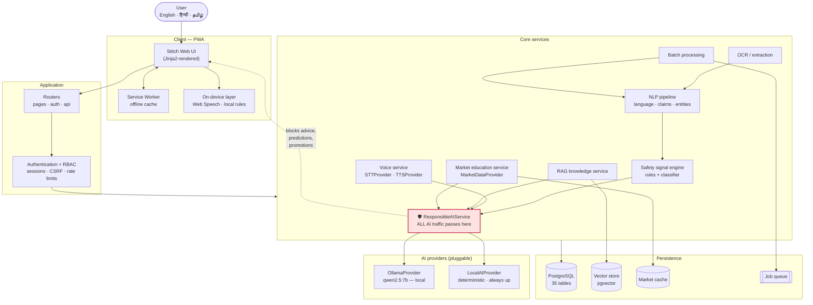
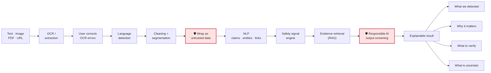
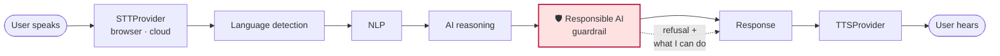
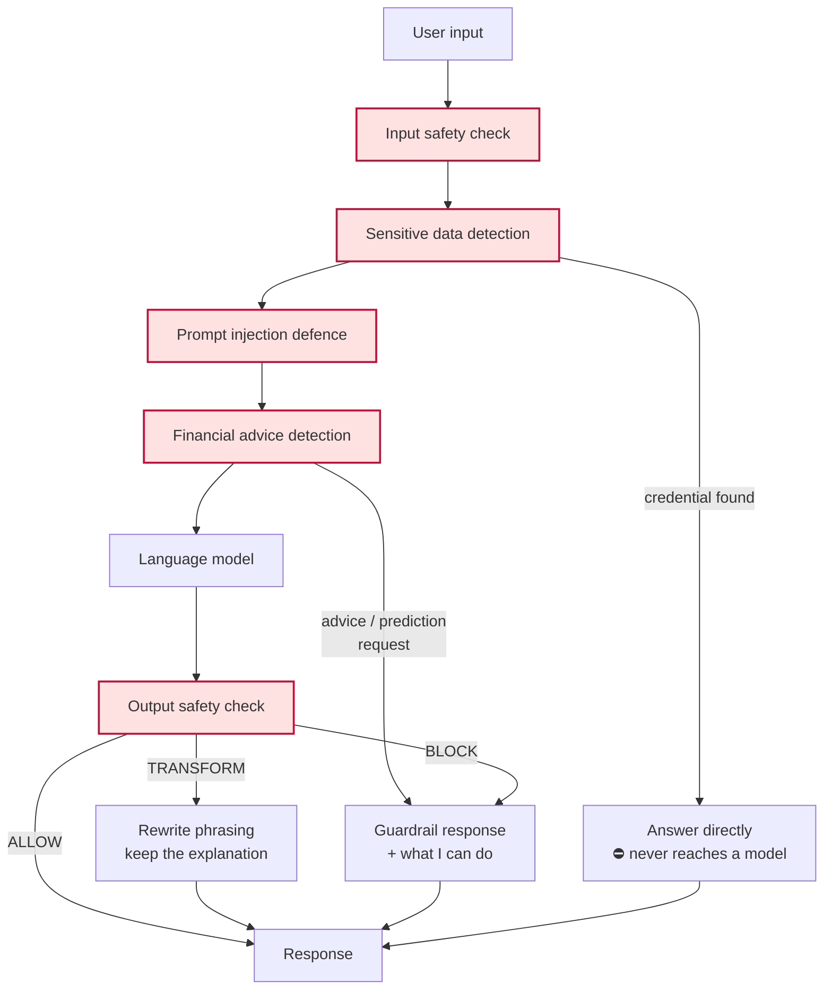

# NIRVAAN — Architecture

> **Pause. Understand. Reflect. Decide for yourself.**
>
> NIRVAAN is a multilingual, voice-first financial resilience companion. It
> explains financial information, surfaces safety signals, and helps people
> pause and reflect. It never makes an investment decision for anyone.

---

## 1. Design principles

Five rules shape every decision in this codebase.

| Principle | How it is enforced |
|---|---|
| **No investment advice, ever** | `app/services/responsible_ai.py` screens both input and output. Advice-shaped output is withheld, not softened into a hint. |
| **External content is data, never instruction** | Everything NIRVAAN did not author — pasted messages, OCR text, PDFs, URLs, RAG chunks, market data — is wrapped by `wrap_untrusted()` before reaching a model. |
| **Deny by default** | Memory off, transcripts unstored, family access none, analytics opt-out. Privacy defaults are the conservative ones. |
| **Honest degradation** | Every AI path has an offline fallback that says what it cannot do rather than inventing an answer. Synthetic market data is always labelled. |
| **Authorization at three layers** | Template visibility (cosmetic) → route guard → query-layer `OwnedRepo`. The query layer is the one that actually protects data. |

---

## 2. Stack

| Layer | Choice | Why |
|---|---|---|
| UI | **Stitch HTML → Jinja2 templates** | The Stitch export is the visual source of truth. Templates keep its markup byte-for-byte; see §7. |
| API | **FastAPI** (sync handlers in a threadpool) | Typed dependencies, automatic validation, trivial testing via `TestClient`. |
| Database | **PostgreSQL** (SQLite dev fallback) | Relational integrity with per-user foreign keys; `pgvector` for RAG embeddings. |
| ORM / migrations | **SQLAlchemy 2.0 + Alembic** | Typed models, parameterised queries throughout, reviewable migrations. |
| AI | **Ollama** (`qwen2.5:7b`) + deterministic fallback | Runs locally: no API key, no data egress, works offline. |
| Auth | **Argon2id + opaque server-side sessions** | Only digests stored; a database leak yields no live session. |
| Offline | **PWA + service worker** | Lessons, journal, reflection and the pause timer survive going offline. |

---

## 3. High-level system architecture



**The single most important property of this diagram:** there is no path from
any provider to the UI that bypasses `ResponsibleAIService`.

---

## 4. AI analysis pipeline — "Check a Message"



Three things are deliberate:

- **The user can correct OCR output before analysis.** Acting on a misread
  screenshot would be worse than asking.
- **Wrapping happens before the NLP stage**, so an injection payload inside a
  screenshot is analysed as data from the first moment.
- **The output is always four panes.** A status with no evidence and no
  statement of uncertainty is not an acceptable result.

### Status vocabulary

Only three outcomes exist, and none of them asserts fraud or safety:

| Status | Meaning |
|---|---|
| `MULTIPLE_SIGNALS_DETECTED` | Several warning signals co-occur. Worth careful verification. |
| `NEEDS_VERIFICATION` | Something is checkable and has not been checked. |
| `NO_OBVIOUS_WARNING_SIGNALS_DETECTED` | Nothing known was matched. **Not** a statement that it is safe. |

---

## 5. Voice architecture



Controls: microphone, stop, replay, pause, **slower**, translate, explain
simply. Speech rate and "explain simply" are accessibility features, not
preferences — they are what make the assistant usable for the senior citizens
and low-literacy users in the target audience.

Provider keys never reach the browser. The default path uses the browser's own
Web Speech API, which keeps audio on the device entirely.

---

## 6. Database

### 6.1 Entity relationships

```mermaid
erDiagram
    USERS ||--o{ USER_ROLES : has
    ROLES ||--o{ USER_ROLES : assigned

    USERS ||--|| USER_PREFERENCES : owns
    USERS ||--|| USER_PRIVACY_SETTINGS : owns
    USERS ||--o{ SESSIONS : creates
    USERS ||--o{ EMAIL_VERIFICATIONS : requests
    USERS ||--o{ PASSWORD_RESETS : requests

    USERS ||--o{ JOURNAL_ENTRIES : writes
    USERS ||--o{ MEMORIES : owns

    USERS ||--o{ REFLECTION_SESSIONS : completes
    REFLECTION_SESSIONS ||--o{ REFLECTION_ANSWERS : contains

    USERS ||--o{ LEARNING_PROGRESS : tracks
    LEARNING_CONTENT ||--o{ LEARNING_PROGRESS : referenced

    USERS ||--o{ MESSAGE_ANALYSES : performs
    MESSAGE_ANALYSES ||--o{ ANALYSIS_SIGNALS : contains
    MESSAGE_ANALYSES ||--o{ ANALYSIS_SOURCES : references
    SAFETY_RULES ||--o{ ANALYSIS_SIGNALS : produces

    USERS ||--o{ UPLOADED_FILES : uploads
    USERS ||--o{ BATCH_JOBS : creates
    BATCH_JOBS ||--o{ BATCH_ITEMS : contains
    UPLOADED_FILES ||--o{ BATCH_ITEMS : feeds

    USERS ||--o{ VOICE_SESSIONS : creates
    VOICE_SESSIONS ||--o{ VOICE_MESSAGES : contains

    RAG_DOCUMENTS ||--o{ RAG_CHUNKS : contains
    RAG_CHUNKS ||--o{ RAG_EMBEDDINGS : indexed

    USERS ||--o{ FAMILY_RELATIONSHIPS : participates
    FAMILY_RELATIONSHIPS ||--o{ FAMILY_PERMISSIONS : controls
    FAMILY_RELATIONSHIPS ||--o{ FAMILY_INVITATIONS : uses

    MARKET_DATA_CACHE ||--o{ MARKET_EDUCATIONAL_SCENARIOS : supports

    USERS ||--o{ NOTIFICATIONS : receives
    USERS ||--o{ AUDIT_LOGS : generates
```



Plus three unparented operational tables: `SYSTEM_EVENTS`, `FEATURE_FLAGS`,
and Alembic's `alembic_version`. **35 application tables** in total.

### 6.2 Table groups

| Group | Tables |
|---|---|
| Identity | `users`, `roles`, `user_roles`, `sessions`, `email_verifications`, `password_resets` |
| Preferences | `user_preferences`, `user_privacy_settings` |
| Family | `family_relationships`, `family_permissions`, `family_invitations` |
| Reflection | `journal_entries`, `memories`, `reflection_sessions`, `reflection_answers` |
| Learning | `learning_content`, `learning_progress` |
| Analysis | `message_analyses`, `analysis_signals`, `analysis_sources`, `safety_rules`, `uploaded_files` |
| Batch | `batch_jobs`, `batch_items` |
| Voice | `voice_sessions`, `voice_messages` |
| RAG | `rag_documents`, `rag_chunks`, `rag_embeddings` |
| Market | `market_data_cache`, `market_educational_scenarios` |
| Operations | `notifications`, `audit_logs`, `system_events`, `feature_flags` |

### 6.3 Rules the schema follows

- **Every user-owned table carries `user_id`** with `ON DELETE CASCADE`, so
  deleting an account removes its data.
- **Indexes** on `user_id`, `created_at`, `status`, `job_id`, `email`, `role`,
  `relationship_id`, plus composites for the common
  `(user_id, created_at)` and `(job_id, status)` reads.
- **Parameterised queries only.** No string-built SQL anywhere.
- **Portable column types** (`app/models/types.py`): `GUID` is native `uuid`
  on Postgres and `char(36)` on SQLite; `JSONColumn` is `JSONB` or `JSON`;
  `Embedding` is a `pgvector` column or a JSON float list.
- **Credentials are never columns.** There is no field anywhere for an OTP,
  PIN, card number or bank account; `responsible_ai.safe_to_remember()` guards
  the one free-text path (`memories`) that could otherwise receive one.

### 6.4 What an ADMIN cannot read

`PRIVATE_FROM_ADMIN` in `app/security/rbac.py` names the resource types that
operational access does not include:

```
journal_entries · memories · voice_sessions · voice_messages
reflection_answers · message_analyses
```

Admin routes call `assert_not_private_for_admin()`, which raises. Admins get
aggregate counts, system health and security logs — never private content.
The audit log itself stores only identifiers and scrubbed context, so reading
the audit trail does not become a side channel into user content.

---

## 7. How the Stitch UI became the application

The Stitch export is the **visual source of truth** and is never edited.
`scripts/extract_templates.py` is a re-runnable build step:

```
nirvaan_dashboard/code.html  ──┬──▶  app/templates/partials/head.html     (fonts + Tailwind tokens)
   (canonical shell donor)     ├──▶  app/templates/partials/sidebar.html  (nav → Jinja loop)
                               ├──▶  app/templates/partials/topbar.html   (breadcrumb, language, badges)
                               └──▶  app/templates/base.html              (shell + )

nirvaan_register/code.html   ─────▶  app/templates/auth_base.html

<each export>/code.html      ─────▶  app/templates/pages/<slug>.html
                                      + inner <main> verbatim
```

Each page template holds the **inner HTML of its `<main>` element, unchanged**.
Only four substitutions are made in the shell:

| Was hard-coded | Became |
|---|---|
| 12 `<a data-path=…>` nav links | loop over `app/navigation.py`, same class strings |
| `Priya Sharma` / `Learning • Growing` | the signed-in user |
| `English` | the active language |
| Always-on notification dot | `` |

Re-running the script is safe: it refuses to overwrite a page template that
has been hand-edited unless `--force` is passed.

### One substantive change to the design

The register export carried a badge reading **"SEBI Registered Framework
Safe"**. That is an unverified regulatory authority claim — the exact pattern
`FAKE_AUTHORITY_EN` teaches users to distrust — so the extractor replaces it
with **"Non-commercial · Educational only"**. Shipping it would have made the
product do the thing it warns about.

### Supplementary CSS only

`app/static/css/nirvaan.css` adds nothing the Stitch tokens already express.
It covers larger-text and high-contrast modes, 44px minimum touch targets,
focus visibility, `prefers-reduced-motion`, data-saver suppression of blur
layers, taller line-height for Devanagari and Tamil (the Latin-tuned line
heights clip diacritics), and print styles for taking an analysis to a bank.

---

## 8. Responsible AI pipeline



### Output verdicts

| Verdict | Trigger | Behaviour |
|---|---|---|
| `ALLOW` | no violation | passes through unchanged |
| `TRANSFORM` | absolutes, guarantee claims, fraud certainty | offending phrasing rewritten, explanation kept |
| `BLOCK` | directive advice, ranking, broker promotion, prediction | draft discarded, guardrail response returned |

The distinction matters: `TRANSFORM` preserves a useful explanation that was
merely phrased too strongly, while `BLOCK` throws the answer away because its
*substance* was a recommendation.

### Injection defence

`wrap_untrusted()` encloses external content in explicit delimiters, breaks up
any delimiter the content itself contains (so it cannot close the envelope
early), and appends a standing instruction that the block is data. The system
prompt independently states that its rules override anything appearing later,
including inside user content.

---

## 9. Pluggable providers

Four provider families, each behind an interface, so any one can be swapped
without touching a feature.

```
AIProvider        → OllamaProvider · LocalAIProvider          (app/services/ai/)
MarketDataProvider→ Mock · External · Cached                  (planned)
STTProvider       → Browser Web Speech · cloud                (planned)
TTSProvider       → Browser Web Speech · cloud                (planned)
```

`ProviderRegistry` orders providers by preference (`AI_PROVIDER_ORDER`),
caches health for 30s, fails over on error, and **always appends
`LocalAIProvider` last** — so a request can never end with nothing to say.
A provider that fails mid-call is marked unhealthy so the next request skips
it immediately.

`LocalAIProvider` is not a stub: it is a reviewed template bank keyed by
detected intent, plus a deterministic hashing embedder that degrades RAG to
keyword-like retrieval rather than failing. It says plainly when it cannot
help.

No API keys ever reach the browser. Ollama is reached over localhost, so
message content does not leave the machine.

---

## 10. Offline behaviour

The service worker policy is deliberately conservative, because a stale cache
in a financial-safety tool is worse than an honest error.

| Content | Strategy | Why |
|---|---|---|
| Static assets | cache-first | versioned by cache name |
| `/learn`, `/help`, `/shield`, `/responsible-ai`, `/offline` | stale-while-revalidate | educational, safe when slightly old |
| Everything else | **network only** | a cached dashboard or analysis would imply freshness it does not have |
| POSTs | never cached, never replayed | replaying a financial action is unacceptable |

| Works offline | Needs a connection |
|---|---|
| Saved lessons, journal, reflection questions, five-minute pause timer, basic safety rules, cached language resources | Full assistant, RAG retrieval, live verification, external market data, cloud STT/TTS |

The UI states which mode it is in (`partials/offline_banner.html`), and
`body.is-offline [data-requires-network]` visibly disables controls that
cannot work — rather than letting them fail silently on tap.

---

## 11. Security posture

| Control | Implementation |
|---|---|
| Password storage | Argon2id, fresh salt, auto-rehash when parameters age |
| Session tokens | 256-bit random; only SHA-256 digest persisted |
| Session lifecycle | TTL, revocation, revoke-all on password reset |
| Brute force | per-IP rate limit (shared via Redis across workers when configured) + per-account lockout after 8 failures |
| Account enumeration | identical responses for unknown vs. wrong-password, and for unknown reset addresses |
| CSRF | double-submit cookie; `verify_csrf` on every state-changing route |
| Open redirect | `next` accepted only as a same-site relative path |
| Headers | CSP (CDN hosts allowlisted explicitly), HSTS in production, `X-Frame-Options: DENY`, `nosniff`, Permissions-Policy limiting microphone to self |
| SQL injection | SQLAlchemy parameterised queries throughout |
| Cross-user reads | `OwnedRepo` forces `user_id`; unknown ids return 404, not 403, so ids are not confirmed |
| Audit | append-only, with a key scrubber that redacts anything credential-shaped |
| Production guards | startup refuses to run with the default `SECRET_KEY`; logs an error if cookies are not secure |

---

## 12. Repository layout

```
app/
  main.py              FastAPI app, security headers, error handlers
  config.py            env-driven settings
  db.py                engine, session, Base
  deps.py              DB / current-user / guard / throttle dependencies
  navigation.py        sidebar definition (labels and classes from Stitch)
  templating.py        Jinja env + shared render context
  models/              35 tables across 9 domain modules
  security/            passwords · tokens · csrf · ratelimit · rbac
  services/            auth · audit · mail · i18n · responsible_ai · ai/
  routers/             auth · pages · api
  templates/           base · auth_base · partials/ · pages/
  static/              css · js (incl. sw.js) · img · manifest · offline.html
  i18n/                en.json · hi.json · ta.json
alembic/               migration environment + versions/
scripts/
  extract_templates.py Stitch HTML → Jinja templates (re-runnable)
  seed.py              schema + roles, flags, 20 safety rules, content
tests/                 83 tests: guardrails, auth, RBAC, data isolation
docs/ARCHITECTURE.md   this file
requirements.txt       base deps (version floors, not pins)
requirements-postgres.txt  psycopg + pgvector, installed only for Postgres
requirements-redis.txt redis + rq (+ fakeredis for tests), for multiple workers
requirements-ml.txt    optional OCR / local embeddings
<17 Stitch export dirs>/  untouched visual source of truth
```

---

## 13. Current state

**Working end to end** (168 automated tests): authentication and sessions,
RBAC, the guardrail engine, provider failover (Ollama → reviewed offline
answers), whole-page Hindi/Tamil translation, and these features wired to real
data: Dashboard, Talk to NIRVAAN (browser speech in/out, `/api/talk`), Check a
Message (text / link / image / PDF via the rule-based signal engine), Batch
Analysis (background jobs), Pause & Reflect (5-step flow), Learn & Explore
(10 trilingual lessons with progress, bookmarks and official resources), My
Journey, Decision Readiness, Family Mode, Privacy Center, Settings, Help,
Offline notes, Admin console with AI usage, printable reports and the personal
data export. Safety Shield, Responsible AI (page) and Market Education were
removed from the product.

**Known gaps.** OCR needs an engine (`requirements-ml.txt`); without one,
image checks ask the person to type the text they see. Links are judged by the
address only; pages are never fetched. Without Ollama, Talk answers come from
about ten reviewed offline topics. Hindi translations cover the whole UI;
Tamil is missing for the newest Settings/Help/Check/Learn strings. Production
multi-worker deployment needs PostgreSQL and shared upload storage. Redis has
been tested with fakeredis only.

## 14. Scaling out: Redis, multiple workers, job queue

Redis is optional. With `REDIS_URL` empty (the dev default) everything runs in
one process exactly as before. With `REDIS_URL` set and reachable, the state
that used to be per process becomes shared:

| Concern | No Redis (default) | `REDIS_URL` set and reachable |
|---|---|---|
| Rate limits (`security/ratelimit.py`) | in-memory sliding window per process | `RedisRateLimiter`: atomic `INCR`+`EXPIRE` fixed window keyed `nirvaan:rl:<limiter>:<client>:<window>`, one budget across all workers |
| AI provider health (`ai/registry.py`) | 30 s in-process TTL dict | 30 s TTL in Redis, so one probe serves every worker |
| Repeated Talk answers (`services/talk.py`) | in-process cache | shared cache, 1 h TTL |
| Background jobs (`services/jobs.py`) | 2-thread pool in the web process | RQ queue `nirvaan`, run by `scripts/worker.py` |

`app/services/redis_client.py` owns the connection: 0.5 s connect / 1 s socket
timeouts, a failed connection is remembered for 30 s before re-dialling, and an
outage is logged once. Every caller catches Redis errors and drops to its
in-memory twin, so Redis going away degrades sharing but never fails a request
— limits are still enforced, at worst per process. `/api/health` reports
`checks.redis` (`backend: redis|memory`, `reachable`) and `checks.queue`
(`backend: rq|thread`, queue depth); neither can mark the app degraded.

**Answer cache rules.** Only Talk answers produced by a real model, passed by
the output guardrail as `allow`, for questions of ≤ 200 characters with no
credentials, no injection markers and nothing that looks personal (digits,
`@`, first-person words in en/hi/ta). Key = SHA-256 of language + redacted,
normalised question; the question text itself is never stored as a key.

**Jobs.** `jobs.enqueue("module:function", *args)` is unchanged. Under Redis
it enqueues `app.services.jobs.run_target(target, *args)` on RQ; if the
enqueue fails, or no RQ worker is registered for the queue, it runs on the
thread pool instead, so a missing worker never strands a job.
`scripts/worker.py` uses `rq.SimpleWorker` with a timer-based timeout, which
works on Windows (no `fork`, no `SIGALRM`).

**What is already multi-worker safe.** Sessions are DB rows (hashed tokens);
CSRF is a stateless double-submit cookie; account lockout counts live on the
`users` row; the `lru_cache`s (i18n catalogues, UI translations, OCR engine
probe) hold read-only data. None of these need Redis.

**Running it.**

```bash
python -m pip install -r requirements-redis.txt
# .env: REDIS_URL=redis://localhost:6379/0   (and Postgres, see above)
python -m uvicorn app.main:app --host 0.0.0.0 --port 8000 --workers 4
python scripts/worker.py            # one or more, any host that sees Redis + DB
```

**AI usage on /admin.** An "AI usage" card aggregates the last 7 days and
today: calls per provider (Talk turns from the provider recorded on the
assistant row, message checks from `message_analyses.ai_provider`), offline
share (no language model: `local` templates or the `rules` engine), average
latency, guardrail-only answers, and answer-cache hits/misses. Metadata
columns only — never message, transcript or analysis text.
